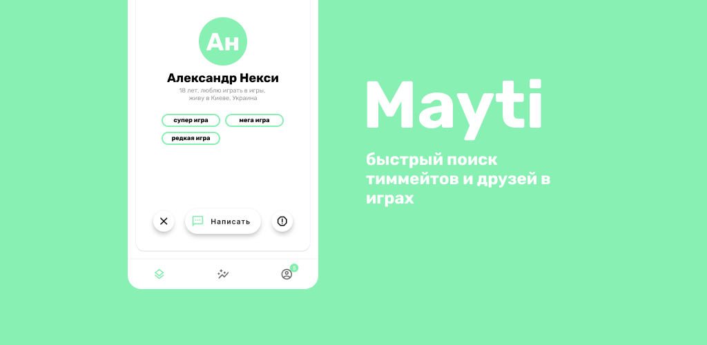

# mayti

> 😖 Данное приложение было создано с целью обучения, в нём может использоваться плохая реализация или плохой подход к чему-либо

 mayti - поможет найти отличного союзника и хорошего друга для ночных игр в сети. Просто листай карточки, выбирая подходящего игрока по критериям - посмотри его биографию, фотографию и его любимые игры в которые он играет, а потом просто напиши - абсолютно бесплатно.
 
## 💻 Демо

Доступно в [Google Play](https://play.google.com/store/apps/details?id=com.ribsky.mayti)

## 🔥 Прогресс

[Перейти в mayti roadmap](https://github.com/nexy791/mayti/projects/1)

## 🤔 Технологии

* Kotlin
* Admob
* Firebase

## ⚛ Зависимости

* [coil](https://github.com/coil-kt/coil)
* [Secure-preferences](https://github.com/scottyab/secure-preferences)
* [CardStackView](https://github.com/yuyakaido/CardStackView)

## ✨ Использование

Никаких ограничений. Полная свобода на использование и изменение исходного кода приложения

## 🤠 Автор

* GitHub: [@nexy791](https://github.com/nexy791)
* Email: nexy791@gmail.com
